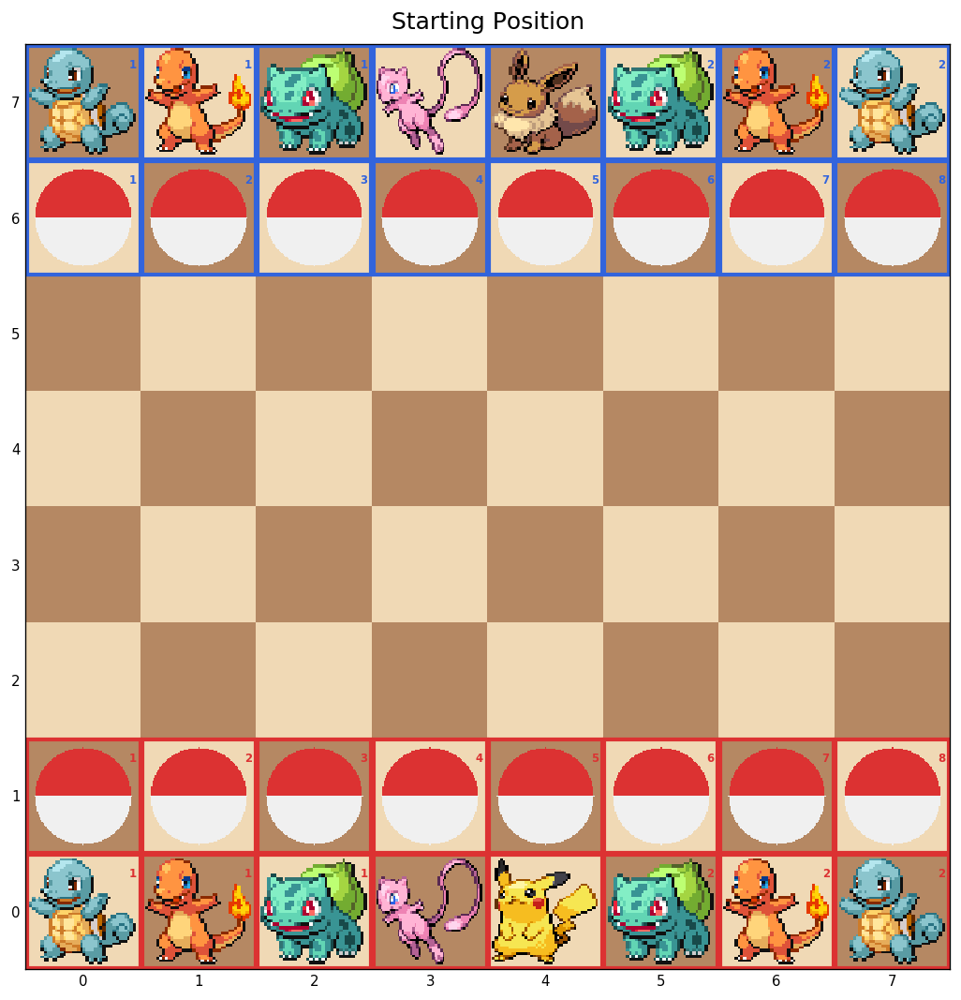

# PokeChess

A hybrid chess / Pokémon battle game. Two players command teams of Pokémon on a standard 8×8 board. Chess governs how pieces move — but each piece has **HP**, **type matchups**, and unique abilities that make every exchange matter.



*RED (Pikachu) deploys from rows 0–1. BLUE (Eevee) holds rows 6–7.*

---

## Try the Demo

Open **`demo/pokechess_demo.ipynb`** in Jupyter for an interactive walkthrough of all game mechanics.

```bash
pip install -r requirements.txt
jupyter notebook demo/pokechess_demo.ipynb
```

Or play against the MCTS bot directly:

```bash
python pokechess_ui.py
python pokechess_ui.py --budget 2.0   # slower, stronger bot
```

---

## Rules Overview

### Pieces

| Piece | Chess Role | Type | HP | Special |
|---|---|---|---|---|
| **Pikachu** | Red King | Electric | 200 | Immune to Stealballs; evolves into Raichu (costs a turn) |
| **Raichu** | Red King (evolved) | Electric | 250 | King moves + Pikachu L-jumps + 2-square cardinal slides; 50% capture rate |
| **Eevee** | Blue King | Normal | 120 | Quick Attack (attack then move same turn); evolves into 5 forms |
| **Mew** | Queen | Psychic | 250 | 3 typed attacks (Fire Blast / Hydro Pump / Solar Beam) + Foresight |
| **Squirtle** | Rook | Water | 200 | Slides along ranks and files |
| **Charmander** | Knight | Fire | 200 | L-shaped jumps; leaps over pieces |
| **Bulbasaur** | Bishop | Grass | 200 | Slides diagonally |
| **Stealball** | Pawn (outer) | — | — | 50% capture on attack; immune to counter-capture; cannot hold items |
| **Master Stealball** | Promoted Stealball | — | — | Guaranteed capture; cannot hold items |
| **Safetyball** | Pawn (middle) | — | — | Stores and heals injured allies; immune to all attacks; cannot hold items |
| **Master Safetyball** | Promoted Safetyball | — | — | Heals stored ally at twice the rate |

**Eevee evolutions** (each 220 HP):

| Evolution | Type | Movement |
|---|---|---|
| Vaporeon | Water | King + full rook sliding |
| Flareon | Fire | King + extended knight jumps |
| Leafeon | Grass | King + extended knight jumps |
| Jolteon | Electric | King + L-jumps + 2-square cardinal slides (same as Raichu) |
| Espeon | Psychic | King + full queen sliding + Foresight |

---

### Starting Layout

The pawn row is split by function:
- **Outer 4 columns (0, 1, 6, 7)** — Stealballs (red/purple top, black bottom)
- **Middle 4 columns (2, 3, 4, 5)** — Safetyballs (red/purple top, white bottom)

RED moves first.

---

### Key Rules

**HP and non-lethal attacks** — Pieces are not immediately removed on contact. The attacker stays put when a hit is non-lethal; a piece only leaves the board when its HP reaches 0.

**Type matchups** — Water beats Fire, Fire beats Grass, Grass beats Water (2× / 0.5× damage). Same-type matchups deal 0.5×. All other matchups deal 1×.

**Stealballs (capture pawns)** — A Stealball attack has a **50%** chance to capture the target (both pieces removed) and 50% to fail (target survives at full HP, Stealball is spent). Master Stealballs always capture. Pikachu is immune to Stealball capture; Raichu is not. Stealballs cannot target other pawns or Pikachu.

**Safetyballs (defensive pawns)** — A Safetyball can move onto an **injured allied** Pokémon to store it inside. While stored, the Pokémon is protected from all attacks and heals ¼ of its max HP each turn the Safetyball moves (½ for Master Safetyball). The stored Pokémon is auto-released at full HP, or can be released manually. Safetyballs cannot store Pikachu, and at least one other allied piece must remain on the board.

**Pawn promotion** — A Stealball reaching the back rank becomes a Master Stealball. A Safetyball reaching the back rank becomes a Master Safetyball.

**Evolution** — Kings evolve mid-game at the cost of a turn. Pikachu evolves into Raichu (gaining HP and 2-square cardinal slides). Eevee evolves into one of five forms depending on its held item. Evolution restores HP equal to the difference in max HP between forms.

**Quick Attack (Eevee)** — Attack first, then move. If the attack KOs the target, Eevee's movement starts from the vacated square. If the target survives, Eevee moves from its original square.

**Foresight (Mew / Espeon)** — Schedule a delayed attack on any square in movement range. Damage resolves at the start of the caster's next turn. Cannot be used on consecutive turns.

**Item trades** — Any non-pawn piece can swap its held item with an adjacent teammate as a free action that does *not* end the turn. Trading an evolution stone to Eevee triggers an immediate auto-evolution and does end the turn. Pawns of any kind cannot hold or trade items.

**No en passant. No castling.**

---

### Win Condition

Eliminate the opposing king. If both kings are eliminated on the same turn, the game is a draw. In timed play, the team with higher total HP wins (Stealball = 50, Master Stealball = 200, all others = current HP; stored Pokémon HP counts).

---

## Project Structure

```
engine/     Core game logic — GameState, move generation, rule execution
bot/        MCTS bot — pure Monte Carlo, no neural network required
tests/      pytest test suite
demo/       Board preview image + sprite assets
docs/       Rules PDF and piece-movement reference diagrams
scripts/    Benchmark utilities
cpp/        C++ hot-loop port via pybind11 (phase 3)
```

## Running Tests

```bash
pytest
```

Hello World
