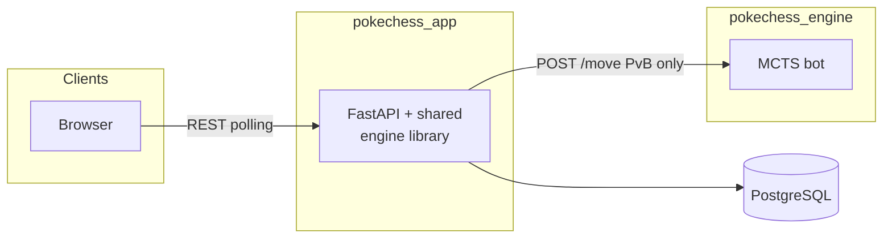
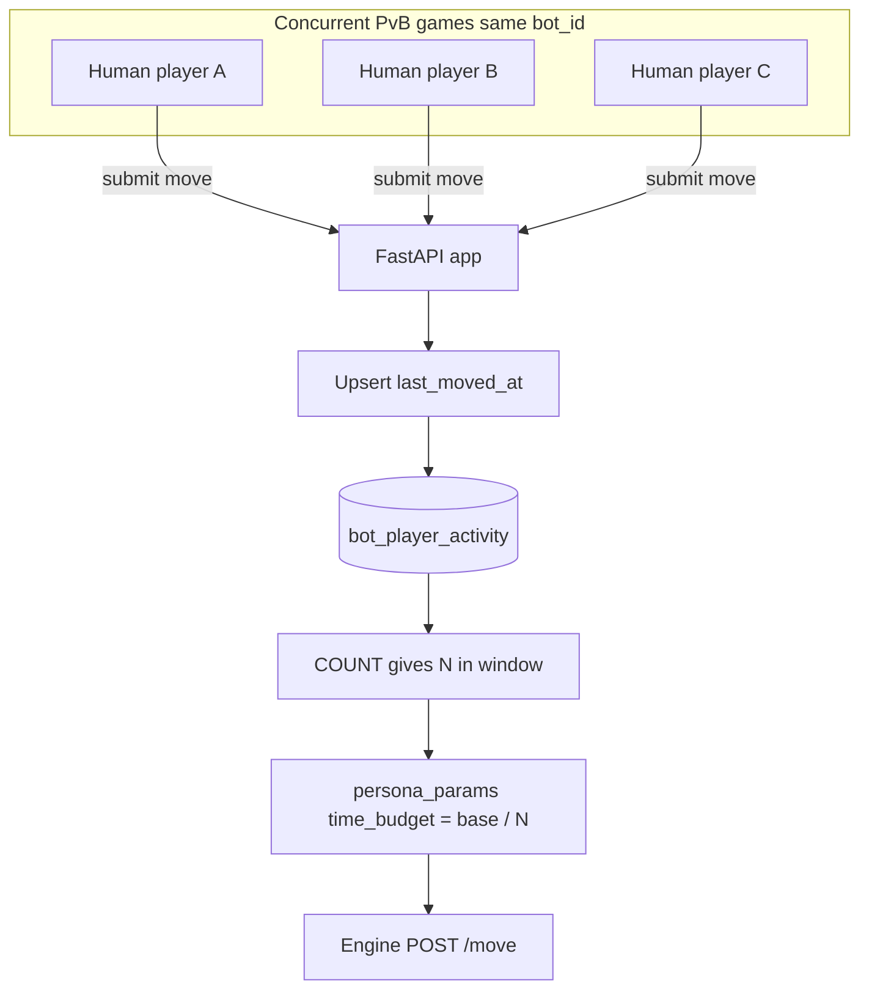

# PokeChess — Master documentation

**Purpose:** This document is the **primary reference** for the PokeChess codebase and product: how the monorepo is organized, how requests and game state flow through the system, what the HTTP API exposes, how data is stored, how the bot and load-aware budgeting work, what the planned frontend must do, and how target deployment fits. Other files under `docs/` add depth (full SQL, exhaustive JSON examples, game rules prose, UX mockups). **If you read one file, read this one**; use the links when you need the full detail of a subsystem.

**Last updated:** April 2026

---

## How to use this document

| If you need… | Start here | Then open… |
|--------------|------------|------------|
| Big picture + contracts | Sections 2–5 below | Same document (no other file required) |
| Exact Pydantic/DB shapes | Sections 5.1–5.2 | `app/schemas.py`, [pokechess_data_model.md](pokechess_data_model.md) |
| DDL and indexes | Section 6 | `app/db/schema.sql`, [pokechess_data_model.md](pokechess_data_model.md) |
| Chess/Pokémon rules | Section 7 | [Rules.md](Rules.md) |
| UI/UX for a future client | Section 8 | [frontend_layout_proposal.md](frontend_layout_proposal.md) |
| AWS/ECS target | Section 10 | [architecture_design_plan.md](architecture_design_plan.md) |
| ML bot / roadmap tasks | Section 9 | [implementation_roadmap.md](implementation_roadmap.md) |

---

## 1. TL;DR

- **Game:** Two-player strategy on an 8×8 board. Chess-like movement, but pieces have **HP**, **Pokémon types**, **items**, and **abilities**. **RED** (Pikachu king) moves first; **BLUE** (Eevee king) second. Win by eliminating the opponent’s king (see [Rules.md](Rules.md)).
- **Modes:** **PvP** — two human accounts (friends + game invites). **PvB** — one human vs bot personality **Metallic** (MCTS); the app calls a separate **engine** service only for the bot’s move choice.
- **Code:** **One monorepo**: `engine/` (pure rules), `app/` (FastAPI + Postgres), `bot/` + `cpp/` (MCTS + optional C++ rollout in the engine image). **Two Docker images** (`Dockerfile.app`, `Dockerfile.engine`) built from the same repo.
- **Truth for HTTP:** `app/schemas.py` and [pokechess_data_model.md](pokechess_data_model.md). Legacy `docs/api_spec.md` was removed; ignore any stray references to it in older notes.
- **Local dev:** `docker-compose.yml` + env (`DATABASE_URL`, `ENGINE_URL`, `SECRET_KEY`, etc.). **Target production:** two ECS services on one small EC2 instance ([architecture_design_plan.md](architecture_design_plan.md)).
- **Engine HTTP container:** The app is ready to call `POST /move`, but **`bot/server.py` is not in the repo yet** and **`Dockerfile.engine`** still expects `uvicorn bot.server:app` — the engine image **does not start** until that module exists ([implementation_roadmap.md](implementation_roadmap.md)). PvB bot moves need a running engine matching `ENGINE_URL`.

---

## 2. Repository layout (monorepo)

### 2.1 Why a monorepo

Game rules live in **one** Python package (`engine/`). Both the app server and the bot **import** that package. Splitting into separate repositories would duplicate `engine/` or force a versioned package; a single repo keeps **one source of truth** and lets CI produce **two images** from one commit.

### 2.2 Dependency rule

```
engine/     ← no imports from app/ or bot/
app/        ← imports engine/
bot/        ← imports engine/
```

### 2.3 Directory tree (conceptual)

```
pokechess/                    ← single repo (may still be named PokeChess-engine in git)
  engine/
    state.py                  # GameState, Piece, enums, PIECE_STATS
    moves.py                  # get_legal_moves(), Move, ActionType
    rules.py                  # apply_move(), is_terminal(), hp_winner()
    zobrist.py                # transposition hashing (engine-side search)
  bot/
    mcts.py, ucb.py, transposition.py
    # bot/server.py — FastAPI HTTP wrapper (required for production PvB; see roadmap)
  cpp/                        # optional C++ rollout; pybind11 bridge
  app/
    main.py                   # FastAPI, lifespan, DB pool, httpx engine client
    routes/                   # auth, users, friends, invites, games, moves
    db/                       # schema.sql, asyncpg queries
    game_logic/               # serialization, XP, roster helpers
    engine_client.py          # POST to engine /move
  tests/
  docs/
  Dockerfile.app
  Dockerfile.engine
  docker-compose.yml
```

**Rename note:** The repo may still be named `PokeChess-engine`; renaming to something like `pokechess` before CI/CD reduces confusion now that `app/` exists ([implementation_roadmap.md](implementation_roadmap.md)).

### 2.4 Container responsibilities

| Concern | Where it runs | Mechanism |
|---------|----------------|-----------|
| Validate moves | App | `get_legal_moves(state)` from `engine/` |
| Apply moves (human + bot) | App | `apply_move()` from `engine/` |
| Terminal / winner | App | `is_terminal()` from `engine/` |
| Expose legal moves to client | App | Filter `get_legal_moves()` by piece |
| Choose bot move | Engine container | MCTS `select_move` → returns a move; **does not** apply it or touch Postgres |
| Persist state | App | Postgres JSONB + columns |
| XP at game end | App | Scan `move_history`, update `game_pokemon_map` / `pokemon_pieces` |

The **engine container is stateless for game rules**: it receives a state dict, searches, returns a move JSON. **Only PvB** games invoke it, and **only** when it is the bot’s turn.

---

## 3. Product snapshot

### 3.1 PvP flow (high level)

1. Users register / log in (`/auth/*`).
2. They become friends (`/friends/*`).
3. One user sends a **game invite** (`POST /game-invites`); server creates a **pending** game row and invite.
4. Invitee **accepts** (`PUT /game-invites/{id}`) → game becomes **active**; both players play via `GET/POST /games/*` and moves.

### 3.2 PvB flow

1. Human creates a game with a **bot_id** and side (`POST /games`) — roadmap and schemas define the exact body.
2. **Metallic** is the seeded bot personality in `bots` (see `app/db/schema.sql`).
3. Difficulty maps to **`time_budget`** (seconds) for MCTS — e.g. Easy 0.5s through Master 10.0s ([frontend_layout_proposal.md](frontend_layout_proposal.md)).
4. After each human move, if the game continues and it is the bot’s turn, the app calls the **engine** `POST /move`, applies the returned move, and returns a single **GameDetail** (human + bot plies in one response when applicable — [implementation_roadmap.md](implementation_roadmap.md) Q3).

### 3.3 Persistent roster (“My Pokémon”)

Each user owns **named** pieces (king, queen, rooks, knights, bishops) stored in `pokemon_pieces`. **Pawns** (Stealballs, Safetyballs, Pokéballs) are **not** roster rows — they are ephemeral on the board. XP and evolution rules interact with **rook/knight/bishop** pieces post-game; kings and Mew have special rules (Section 6.4).

### 3.4 Client application

There is **no shipped production frontend** yet. [frontend_layout_proposal.md](frontend_layout_proposal.md) is the **v1 UX specification** (tablet/phone-first, dark Pokémon-inspired UI). The backend is designed to support polling (`GET /games/{id}` every 1–3s) and clear move payloads for a future client.

### 3.5 Future: solo campaign

[CampaignDesign.md](CampaignDesign.md) describes exploratory **solo campaign** ideas — **not** part of the current build or backend scope.

---

## 4. Runtime architecture

### 4.1 Core services diagram



### 4.2 Load-aware PvB: many humans, one bot personality

When several people play **PvB** against the **same** bot row (e.g. Metallic) at once, the app **does not** give every game the full `time_budget` from `bots.params`. It records each human’s last move in **`bot_player_activity`**, counts how many distinct players are **active** in a sliding time window (`BOT_ACTIVE_WINDOW_MINUTES`), sets **effective_time_budget = base_time_budget / N**, and passes that value in **`persona_params.time_budget`** to the engine. Details: Section 9.2 and [load_aware_budgeting.md](load_aware_budgeting.md).

The diagram is intentionally **linear top-to-bottom**: each step follows the previous; only the **bottom** node is the outbound call to the engine.



### 4.3 Human move path (simplified)

1. Client sends `POST /games/{game_id}/move` with a move matching a legal move from `GET /games/{game_id}/legal_moves`.
2. App loads the row from `games`, checks auth and `whose_turn`, deserializes `state` to `GameState`.
3. App verifies the move is in `get_legal_moves(state)`.
4. App runs `apply_move` (handles Pokéball RNG on the **app** side — engine never rolls RNG for captures).
5. App may inject **foresight_resolve** history entries when a pending Foresight fires.
6. If PvB and bot’s turn next: app calls **engine** `POST /move` with serialized state and `persona_params` (including load-adjusted `time_budget`), parses flat move JSON, validates against legal moves, applies bot move.
7. App writes updated `state`, appended `move_history`, `whose_turn`, `turn_number`, `status`, `winner`, `end_reason` as appropriate; on terminal, runs XP logic.

### 4.4 Polling and payloads

- **`GET /games/{id}`** returns **GameDetail**: metadata plus **`state`** and **`move_history`** JSON for rendering. It does **not** embed legal moves: use **`GET /games/{id}/legal_moves`** (implemented). Roadmap Q4 only ruled out bundling legal moves into `GET /games/{id}` — not whether the legal-moves route exists.
- **`GET /games/{id}/legal_moves?piece_row=&piece_col=`** returns the list of legal **Move** shapes for that piece; the client submits one of those verbatim to `POST /games/{id}/move`.
- **`whose_turn`** in the DB uses lowercase `red` / `blue`; **`games.state.active_player`** uses uppercase `RED` / `BLUE` — normalize when comparing.

### 4.5 Serialization

Wire format for DB and engine requests is owned by the app: **`app/game_logic/serialization.py`** (`state_to_dict` / `state_from_dict` or equivalent) aligned with [pokechess_data_model.md](pokechess_data_model.md). Engine **dataclasses** in `engine/state.py` stay free of JSON methods; the app is the codec boundary.

---

## 5. Contracts

### 5.1 HTTP API surface (implemented routes)

All routes are mounted from `app/main.py`. Prefixes below are **full path prefixes**.

| Method | Path | Purpose |
|--------|------|---------|
| `POST` | `/auth/register` | Create user, default settings, return access token; sets httpOnly refresh cookie |
| `POST` | `/auth/login` | Login; tokens + refresh cookie |
| `POST` | `/auth/refresh` | New access token from refresh cookie |
| `GET` | `/me` | Authenticated user profile + pieces |
| `PATCH` | `/me/settings` | User settings (`board_theme`, `extra_settings` JSONB with API validation) |
| `GET` | `/friends` | Friends + incoming/outgoing friend requests |
| `POST` | `/friends` | Send friend request by username |
| `PUT` | `/friends/{friendship_id}` | Accept or reject (`action` in body) |
| `GET` | `/game-invites` | Pending invites |
| `POST` | `/game-invites` | Create invite + pending game (must be friends) |
| `PUT` | `/game-invites/{invite_id}` | Accept/reject invite |
| `GET` | `/games` | Active + completed lists (**GameSummary** — no heavy JSONB). **Completed** list is capped at **10** rows (most recently updated); active games are not capped (`app/db/queries/games.py`). |
| `POST` | `/games` | Create **PvB** game only — body requires `bot_id` and `player_side` (`CreateGameRequest`). **PvP** games are created via **`POST /game-invites`** (pending row + invite), then activated on accept — not via this endpoint. |
| `GET` | `/games/{game_id}` | **GameDetail** — full `state` + `move_history` |
| `POST` | `/games/{game_id}/resign` | Resign |
| `GET` | `/games/{game_id}/legal_moves` | Legal moves for one piece |
| `POST` | `/games/{game_id}/move` | Submit move; **GameDetail** response (may include bot ply in PvB) |
| `GET` | `/health` | Liveness |

**Authoritative types:** `app/schemas.py` (`RegisterRequest`, `GameDetail`, `MovePayload`, `LegalMoveOut`, etc.).

### 5.2 Auth model (summary)

- **Access token:** JWT in `Authorization: Bearer` for API calls.
- **Refresh token:** HttpOnly cookie (`refresh_token`) on register/login; `/auth/refresh` rotates access.
- **Config:** `SECRET_KEY`, `ACCESS_TOKEN_EXPIRE_MINUTES`, `REFRESH_TOKEN_EXPIRE_DAYS`, `ENVIRONMENT`, `CORS_ORIGINS` — see `app/config.py`. Production must not use the default `SECRET_KEY`.

### 5.3 Engine `POST /move` — **code is canonical**

The app sends (`app/engine_client.py`):

```json
{
  "state": { "...": "GameState wire dict" },
  "persona_params": {
    "time_budget": 1.5
  }
}
```

`time_budget` is **seconds**, possibly **divided by N** active players for load-aware budgeting (Section 9.2). Extra keys in `persona_params` are forwarded for future engine tuning. Values are **clamped** to `[0.1, 30.0]` before the HTTP call.

The engine must return a **flat** JSON object the app can pass into `Move(...)`:

- `piece_row`, `piece_col`, `action_type` (engine enum **name**, e.g. `"ATTACK"`)
- `target_row`, `target_col`
- `secondary_row`, `secondary_col` (e.g. Quick Attack)
- `move_slot` (Mew / Eevee evolution disambiguation)

**Note:** [implementation_roadmap.md](implementation_roadmap.md) §Engine API shows `time_budget` at the **top level** of the JSON; the **running app** nests it under `persona_params`. When implementing `bot/server.py`, accept the **app’s** shape.

### 5.4 Environment variables (app)

| Variable | Role |
|----------|------|
| `DATABASE_URL` | AsyncPG DSN (see `config.asyncpg_dsn()`) |
| `ENGINE_URL` | Base URL for engine (default `http://localhost:5001`) |
| `SECRET_KEY` | JWT signing |
| `ENVIRONMENT` | `development` vs production checks |
| `CORS_ORIGINS` | Comma-separated origins; `*` handled specially for credentialed CORS |
| `BOT_ACTIVE_WINDOW_MINUTES` | Sliding window for load-aware bot budgeting (default 22) |
| `ACCESS_TOKEN_EXPIRE_MINUTES`, `REFRESH_TOKEN_EXPIRE_DAYS` | Token lifetimes |

---

## 6. Data model (concise reference)

**Full DDL and examples:** `app/db/schema.sql` and [pokechess_data_model.md](pokechess_data_model.md).

### 6.1 Core tables

- **`users`** — Identity: username, email, password hash.
- **`user_settings`** — 1:1 with users; `board_theme`, `extra_settings` JSONB for flexible client prefs.
- **`friendships`** — Ordered pair (`user_a_id` < `user_b_id`), status pending/accepted/rejected, initiator tracked.
- **`bots`** — Bot personality rows; **`params` JSONB** holds MCTS knobs (`time_budget`, optional `iteration_budget`, rollout weights, etc.). Seed includes **Metallic**.
- **`game_invites`** — Inviter, invitee, status; ties to games created in pending state.
- **`games`** — Players (nullable slot for bot side), `is_bot_game`, `bot_id`, `bot_side`, `invite_id`, **`status`** (`pending` / `active` / `complete`), **`whose_turn`**, **`turn_number`**, **`state`** JSONB, **`move_history`** JSONB, **`winner`**, **`end_reason`**. Frequently queried fields are real columns, not buried only in JSONB.
- **`pokemon_pieces`** — Persistent named pieces per user: role, species, xp, evolution_stage.
- **`game_pokemon_map`** — Links pieces to a game; **`xp_earned`**, **`xp_applied`**, **`xp_skip_reason`**, **`xp_applied_at`** for idempotent post-game rollup.
- **`bot_player_activity`** — `(player_id, bot_id)` last move time for load-aware budgeting.

### 6.2 `games.state` JSONB (shape)

Canonical snapshot of the board — output of the app’s state serialization aligned with engine semantics:

- `active_player`: `"RED"` | `"BLUE"`
- `turn_number`: int
- `has_traded`, `foresight_used_last_turn`: per-team bool maps
- `pending_foresight`: per-team null or effect (`target_row/col`, `damage`, `resolves_on_turn`)
- `board`: array of **on-board** pieces only (captured pieces are removed)

Each piece object includes: `id` (UUID string or `null` for pawns), `piece_type`, `team`, `row`, `col`, `current_hp`, `held_item`, nested `stored_piece` for Safetyball contents.

### 6.3 `games.move_history` JSONB

Append-only list of turns. **Snake_case `action_type`** strings in history (`attack`, `pokeball_attack`, `foresight_resolve`, …) differ from **engine enum names** in API moves (`ATTACK`, …) — the app maps between them. See the table in [implementation_roadmap.md](implementation_roadmap.md) or [pokechess_data_model.md](pokechess_data_model.md).

### 6.4 XP and evolution (v1 rules)

- **XP earned (v1):** Sum of **`damage`** from `move_history` entries attributed to that **named** piece (attacks, foresight resolve, etc.). Pokéball captures without damage do not add XP. Implemented in a dedicated helper (e.g. `compute_xp`) so the formula can change.
- **`xp_earned` vs `xp_applied`:** Raw earned vs what business rules apply to `pokemon_pieces.xp` (e.g. wins only — see data model).
- **Kings / queen:** `pokemon_pieces.species` for king and queen is **immutable** (`pikachu`, `eevee`, `mew`). Mid-game evolutions (Raichu, Eeveelutions) exist **only** in engine state for that game. **Rooks, knights, bishops** can change species/evolution stage **post-game** via XP thresholds; those updates happen at game completion, not mid-game ([implementation_roadmap.md](implementation_roadmap.md) Q6).

### 6.5 Important indexes

- One **active** PvP game per unordered player pair (unique partial index).
- One **active** PvB game per human + bot (unique partial index).
- `bot_player_activity` indexed by `(bot_id, last_moved_at)` for counting active players.

---

## 7. Game rules (overview)

**Authoritative text:** [Rules.md](Rules.md).

**Condensed overview:**

- **Board:** 8×8; RED rows 0–1, BLUE rows 6–7.
- **Back rank:** Squirtle, Charmander, Bulbasaur, King (Pikachu/Eevee), Mew, mirrored.
- **Pawns:** Stealballs and Safetyballs with distinct columns; special capture and storage rules in [Rules.md](Rules.md).
- **Combat:** Moving onto an enemy attacks; damage uses **types** and multipliers. HP to zero removes the piece.
- **Items & trading:** Stone evolutions, held items, adjacent trade action — full detail in rules doc.
- **Pokéballs / Masterballs:** Capture mechanics with RNG (resolved on **app** when applying moves).
- **Win:** Eliminate opponent king — [Rules.md](Rules.md) §11.

---

## 8. Frontend specification (planned client)

**Source:** [frontend_layout_proposal.md](frontend_layout_proposal.md). **Status:** specification only; **not implemented** in this repo.

**Audience / platform:** Roughly 8–15 years old; **tablet and phone** primary (portrait primary, landscape secondary).

**Visual language:** Dark-field Pokémon aesthetic (`bg-deep` ~`#12141E`), team reds/blues, Gen-1 sprite art, board as hero. Rounded bold fonts (e.g. Nunito, Fredoka One). Highlight tokens for select / move / attack / foresight / trade.

**Key screens:**

1. **Home** — Play vs Bot, Play vs Friend, My Pokémon, Settings.
2. **My Pokémon** — Scrollable roster cards (species, type, XP bar, held item); read-only v1.
3. **Difficulty (PvB)** — Easy → Master mapping to **0.5s–10.0s** `time_budget`; flavour copy for Metallic.
4. **Lobby** — Creating game or waiting on invite acceptance (share code, cancel).
5. **Gameplay** — 8×8 board, team banners, HP, legal highlights by action type, bottom sheet for **Mew** multi-attack and **Eevee** evolution choice, **Metallic is thinking…** state during long engine waits, Pokeball shake animation using history `rng_roll` / `captured`, Foresight cyan overlay + resolve feedback, Quick Attack two-step selection.
6. **Game over** — Winner by team, XP earned per piece; evolution progress for pieces that evolve via XP (not kings/queen per Q6).

**Design principles (samples):** No algebraic notation required for kids; ambiguous moves use a **bottom sheet**; PvB wait up to **10s** on Master — UI must show clear loading/grayout ([frontend_layout_proposal.md](frontend_layout_proposal.md) resolved decisions table).

---

## 9. Bot, MCTS, load-aware budgeting, and roadmap

### 9.1 MCTS engine container

- **Bot code:** `bot/mcts.py` etc.; optional **C++** rollout in `cpp/` for speed.
- **HTTP surface (repo state):** The app’s client (`app/engine_client.py`) describes **`POST /move`** with `{ "state", "persona_params" }`. **`bot/server.py` does not exist in the tree yet** — there is no FastAPI app under `bot/` to run. **`Dockerfile.engine`** is wired to `uvicorn bot.server:app` (see repo root Dockerfile), so **building and running that image as-is will fail** until `bot/server.py` (or an equivalent module path) is added. [implementation_roadmap.md](implementation_roadmap.md) tracks this as blocking for production PvB. **PvP never needs the engine.**
- **Persistence:** There is **no** app-triggered **`POST /backup`** or app-orchestrated engine backup. Transposition tables and other bot-side state are **owned by the bot server** inside the engine container (e.g. **local SQLite**), not RDS — see [architecture_design_plan.md](architecture_design_plan.md) and [app_and_engine_communication.md](app_and_engine_communication.md).
- **Future:** `engine/notation.py` for PokeChess-PGN replay/analysis (not required for Postgres).

### 9.2 Load-aware budgeting (implemented in app)

See **Section 4.2** for a diagram of multiple PvB players sharing one bot personality.

Problem: many humans vs the same bot concurrently would each get the full `time_budget` → too much total search time.

**Mechanism:**

1. On each human move in PvB, **upsert** `bot_player_activity` for `(player_id, bot_id)`.
2. Before calling the engine, **count** distinct players with `last_moved_at` in the last **`BOT_ACTIVE_WINDOW_MINUTES`** minutes for that `bot_id`.
3. **effective_time_budget = base_time_budget / N** where `base_time_budget` comes from `bots.params->time_budget` (difficulty). Pass result in `persona_params["time_budget"]`.

The engine does not need separate code paths — it just receives a smaller `time_budget`. See [load_aware_budgeting.md](load_aware_budgeting.md) for SQL and examples.

### 9.3 Roadmap pointer

**Open work, priorities, ML vs app tasks:** [implementation_roadmap.md](implementation_roadmap.md) §Next Steps. **Historical ML notes:** [task_log.md](task_log.md).

---

## 10. Infrastructure and deployment (target)

This is the **intended** production shape, not a guarantee about your current laptop setup.

- **Repo:** Monorepo builds **two** images → push to **ECR** → **ECS** on a single **EC2 t4g.small** (cost estimates in [architecture_design_plan.md](architecture_design_plan.md)).
- **Services:** `pokechess-app` (public HTTP, port 8000), `pokechess-engine` (internal, port 5001, not exposed publicly). On the **same EC2 host**, the app calls the engine at **`ENGINE_URL`** (typically **`http://localhost:5001`**, matching [`app/engine_client.py`](../app/engine_client.py) and compose).
- **Browser → app:** HTTP polling (or SSE later); latency on the order of seconds is acceptable.
- **App → engine:** **`POST /move` only** — payload `{ "state", "persona_params" }` per `engine_client.py`. **No** app-triggered backup endpoint; bot-side persistence (e.g. TT in **local SQLite**) stays inside the engine process.
- **DB:** **Amazon RDS (PostgreSQL)** for **all** app tables — the FastAPI app is the only service using `DATABASE_URL` / RDS. The engine **does not** connect to RDS.
- **Frontend assets:** React/Next on S3 + CloudFront when a client exists (static assets only; unrelated to engine TT storage).
- **Concurrency / queue:** The engine target is a **queue**: **one MCTS search at a time** per instance, with requests waiting when busy — [architecture_design_plan.md](architecture_design_plan.md). Pair with load-aware **`time_budget`** scaling in the app ([load_aware_budgeting.md](load_aware_budgeting.md)).

**Deferred (v2):** Dedicated compute for engine, start/stop on demand ([architecture_design_plan.md](architecture_design_plan.md)).

---

## 11. Documentation map

| Document | Role |
|----------|------|
| [MASTERDOC.md](MASTERDOC.md) | **This file** — unified reference |
| [implementation_roadmap.md](implementation_roadmap.md) | Monorepo checklist, container duties, state/history tables, Q&A decisions, next steps |
| [pokechess_data_model.md](pokechess_data_model.md) | Full schema, JSON examples, HTTP model tables, detailed move lifecycle |
| [architecture_design_plan.md](architecture_design_plan.md) | Target AWS/ECS/EC2/cost/queue narrative |
| [app_and_engine_communication.md](app_and_engine_communication.md) | App ↔ engine contract, RDS vs bot-local persistence, queue model — aligned with **`engine_client.py`** |
| [load_aware_budgeting.md](load_aware_budgeting.md) | Load-aware MCTS budgeting |
| [frontend_layout_proposal.md](frontend_layout_proposal.md) | v1 UI/UX spec (no frontend implemented) |
| [Rules.md](Rules.md) | Full game rules |
| [CampaignDesign.md](CampaignDesign.md) | **Future** solo campaign — not current build |
| [task_log.md](task_log.md) | Historical ML task log |
| [TT_s3_upload.txt](TT_s3_upload.txt) | Older TT / S3 design notes — may not match current “bot-local persistence” direction; see [architecture_design_plan.md](architecture_design_plan.md) |
| PDFs (optional assets) | Some checkouts include boards/movement/notation PDFs under `docs/`; **this tree may have none** — if missing, they are optional reference art, not required to run the app. |

---

## 12. Documentation freshness

Use **git history** on `docs/` (e.g. `git log -- docs/`) to see what changed recently. Doc updates sometimes land on long-lived integration branches first; **there is no single branch name** that applies in every clone—compare your branch to `main` (or your default) when auditing.

---

## 13. Known gaps and contradictions (for maintainers)

| Topic | Notes |
|-------|--------|
| **Roadmap vs app engine JSON** | Roadmap shows top-level `time_budget`; app uses `persona_params.time_budget`. |
| **`app_and_engine_communication.md`** | May reference removed files or wrapped move JSON — **use `engine_client.py` + `moves.py`**. |
| **Roadmap vs routes** | Roadmap sometimes says `PATCH` for invites/friends; implementation uses **`PUT`**. |
| **Data model move lifecycle** | One step may mention updating `species` mid-game; Q6 decisions say kings/queen immutable, other pieces post-game — reconcile wording in [pokechess_data_model.md](pokechess_data_model.md) when editing. |
| **Frontend UX copy** | Occasional “~3s” bot wait vs **10s** Master tier — treat **10s** as worst case for UX. |
| **Engine doc typos** | “PvP vs engine” should read **PvB** — engine is never used for human-vs-human. |
| **Engine image won’t start** | **`bot/server.py` missing**; `Dockerfile.engine` expects it — see Section 9.1 and TL;DR. |

---

## 14. Application README

For a short pointer into the `app/` tree and import conventions, see [app/README.md](../app/README.md).
